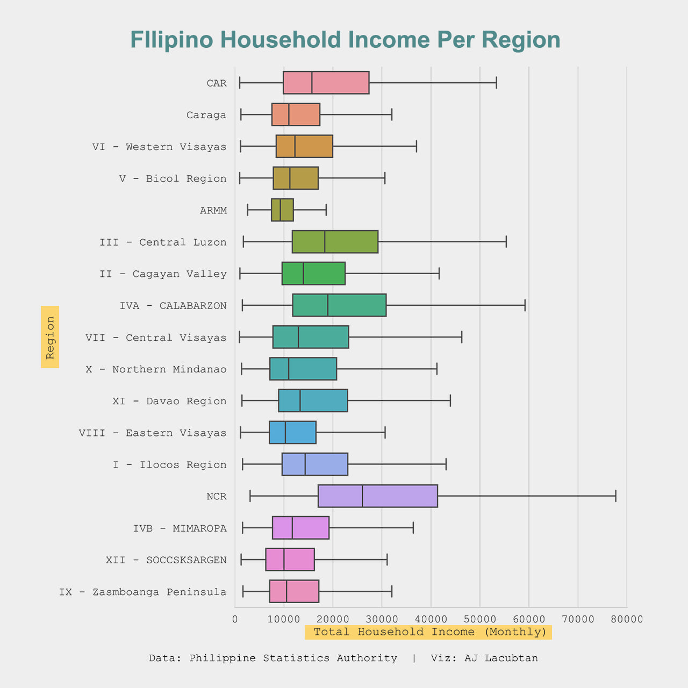
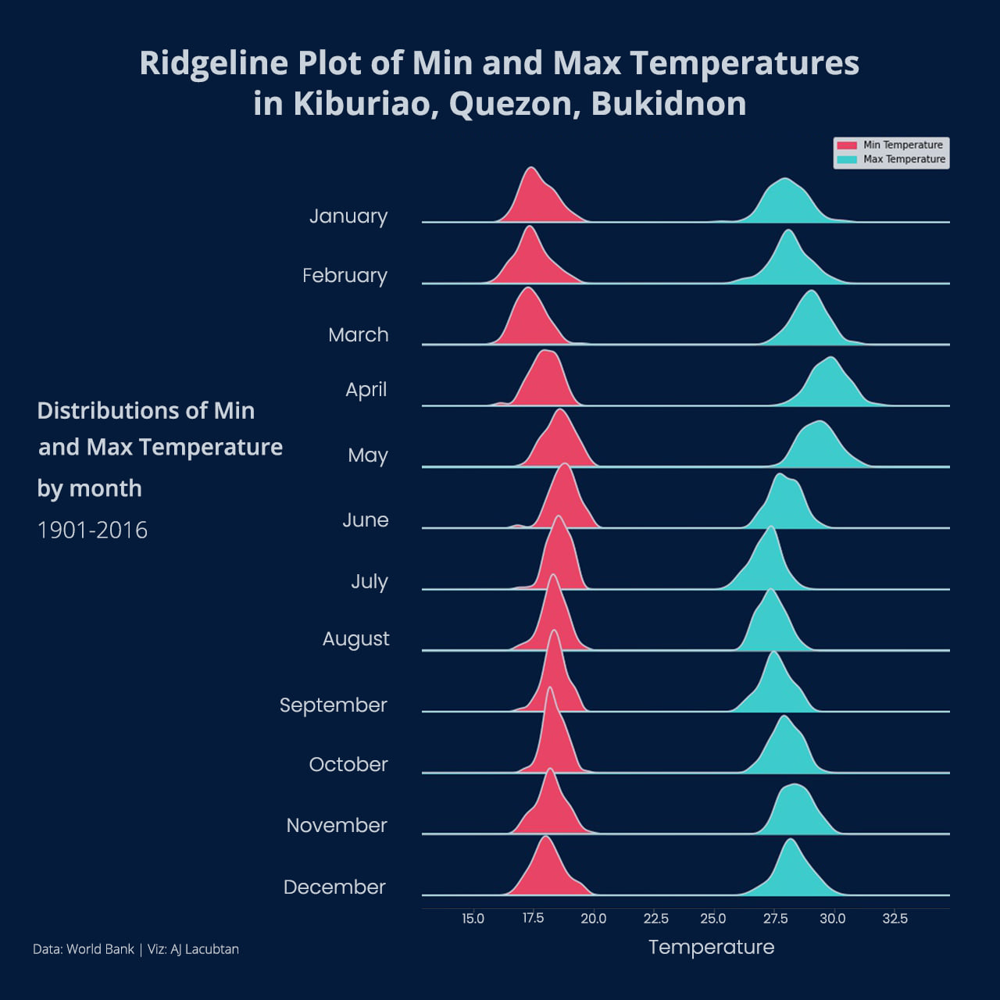
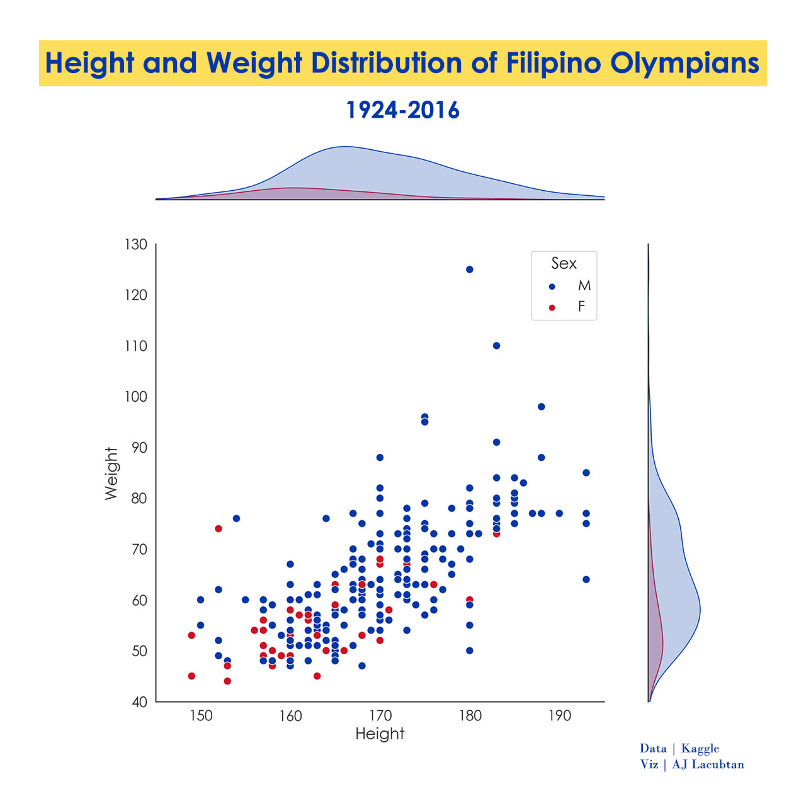
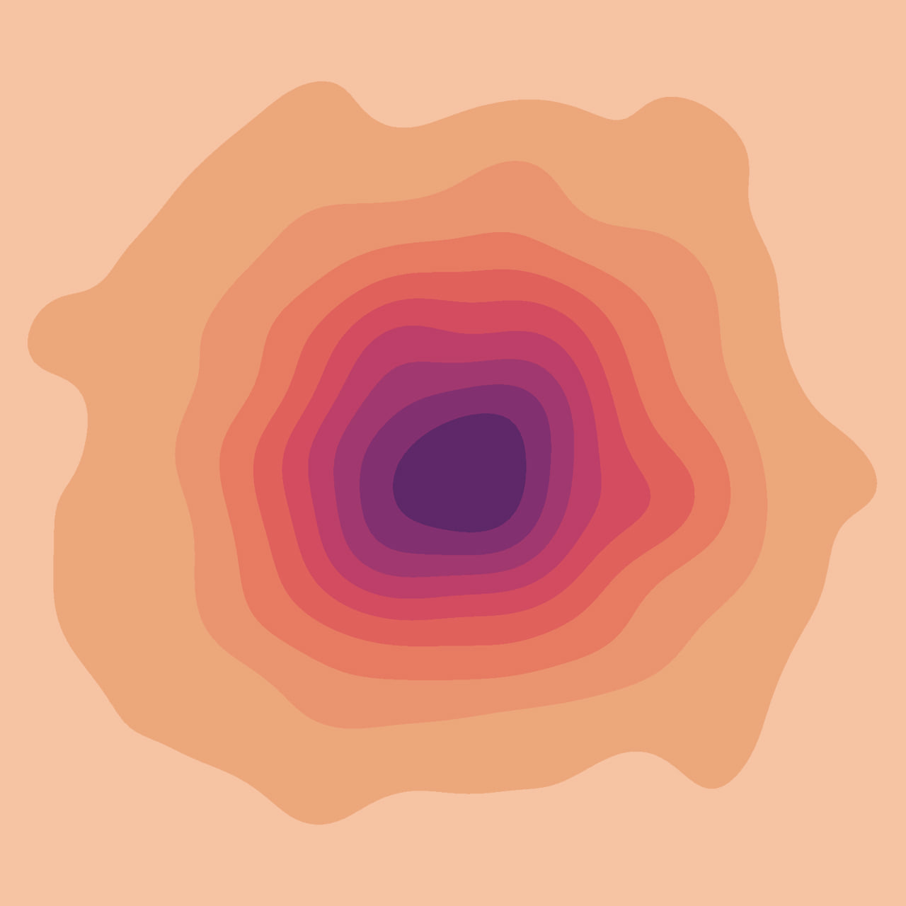

::: {.projects-shell}

::: {.projects-hero}
::: {.eyebrow}
Portfolio
:::

# Projects that turn analysis into usable evidence.

These projects highlight the parts of data work I care about most: clear framing, defensible methods, careful validation, and outputs that communicate something useful.
:::

::: {.project-feature}
::: {.feature-copy}
::: {.feature-label}
Featured Project
:::

## [Data Visualization Portfolio](projects/data-visualizations/index.qmd)

A curated set of visual stories using Python, R, Matplotlib, Seaborn, and ggplot2. The collection covers income inequality, climate patterns, vaccine rollout, voter demographics, statistical density, and exploratory visual design.

::: {.tool-row}
`Python` `R` `matplotlib` `seaborn` `ggplot2`
:::

[View Project](projects/data-visualizations/index.qmd){.primary-action}
:::

::: {.feature-gallery}
<figure>
  
</figure>
<figure>
  
</figure>
<figure>
  
</figure>
<figure>
  
</figure>
:::
:::

## Project Index

::: {.project-index-intro}
Full project writeups and portfolio entries.
:::

::: {#listing-projects}
:::

:::
